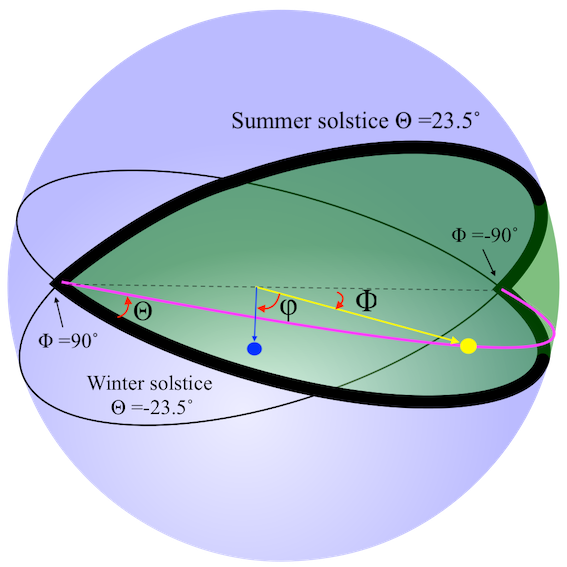

# Understanding the Nature of Photometric Observations of Geostationary Satellites

Observations of flux variations form distant light sources has long been used to measure physical characteristics of celestial systems. Determining the orbital periods of binary stars, searching for exoplanets and classifying supernovae are all activities that has been facilitated by such measurements. The resulting time series of brightness variations is called a light-curve. However, limited light-curve investigations have been conducted on near earth objects, a subset of which are geostationary satellites. This text outlines the process of acquiring such light curves, and attempts to uncover the capabilities of such an investigation. To this end, a python program was developed to convert raw telescope images to light-curves. This process involves chaining a series of astronomical techniques and algorithms, to produce satellite light-curves. 

Investigation into the nature of GEO observations revealed the data to be essentially two dimensional, thus light-curve observations in this space represents a sampling of a light-plane. Setting up a coordinate space of photometric measurements, allows the measuring of certain features by their angular separation. For example, one of the components of the angle between the satellite’s attitude and the observer was estimated to be around 5 ̊, in agreement with broadcasting coverage maps published by the satellite operator.
